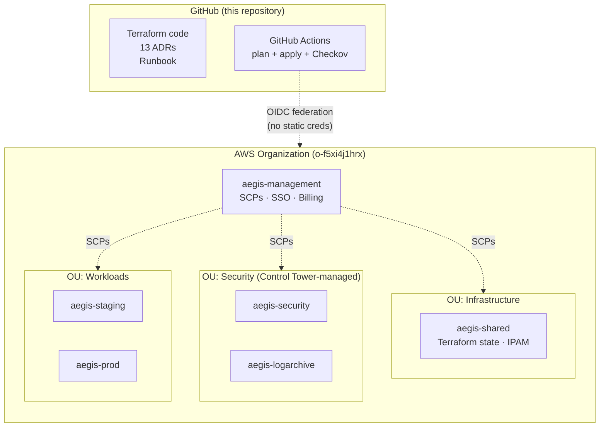

# Aegis AWS Landing Zone

[](https://github.com/BinHsu/aegis-aws-landing-zone/actions/workflows/terraform-apply.yml)
[](https://github.com/BinHsu/aegis-aws-landing-zone/actions/workflows/checkov.yml)


**Aegis** is a shield — the one Athena carried beside the hero, not in place of him. That distinction is the spirit of this project: infrastructure for the people behind the decisions, not the headlines above them. Software is a bridge; business is the ground beneath it. A bridge can be rebuilt; a foundation cannot. This landing zone is built in that posture — speed where it helps, sovereignty where it matters, automation that assumes human judgment rather than replaces it — so that whatever the principals above decide to build can stand on ground that holds.

> A reference implementation of a production-grade multi-account AWS landing zone, managed entirely through GitOps — for single-operator labs and small-team deployments that want AWS best-practice structure without the enterprise overhead.

## Features at a glance

- **Multi-account AWS Organizations** — 6 accounts under Control Tower, 3 OUs, 3 custom SCPs aligned to ISO 27001:2022 Annex A
- **Zero static credentials** — AWS IAM Identity Center for humans, GitHub OIDC for CI/CD, IRSA-ready for workloads; no IAM users (enforced by SCP, not just policy)
- **Terraform 1.14+ with S3 native state locking** — no DynamoDB, Terraservices layered state (ADR-003)
- **GitHub Actions GitOps pipeline** — plan on PR, apply on merge, Checkov security scan, all required status checks
- **Signed commits enforced** — branch protection + SSH-key signing
- **Centralized IPAM with RAM cross-account sharing** — single source of truth for VPC CIDR allocation
- **Fork-and-deploy by config** — one YAML file + two scripts; no per-deployment forks
- **Runbook-proven reproducibility** — 10-part runbook documents every manual step plus the gotchas that broke the first attempt
- **EKS + ArgoCD + Karpenter** — live (Phase 3c): EKS 1.32, Karpenter v1 on Fargate with Spot-first NodePool, AWS Load Balancer Controller, ArgoCD with app-of-apps pointing at `aegis-core` (ADR-012, ADR-013)

## About this project

Built solo by a **hands-on architect** — designs AND implements. Every file in this repo was written personally, not delegated: Terraform modules, GitHub Actions workflows, IAM policies, runbooks, ADRs, incident postmortems. The project exists precisely to prove *architect + executor* in one person.

Stance: ship the cross-cutting scope (multi-account governance, CI/CD, platform bootstrap, security posture, cost discipline) using current-but-stable tools, written line-by-line. Specialist depth in any single area (IAM policy minimization, Karpenter internals, Kubernetes controller-manager internals) is out of scope here and tagged with clear hand-off notes — not because I can't learn it, but because breadth + execution is where my value sits, and a specialist's depth is better invested when they arrive. Explicit scope in [`docs/interview-notes.md §4`](docs/interview-notes.md).

The project value is execution *and* discipline, layered together: 13 ADRs (several with "Design iteration" sections documenting reversed decisions honestly), 20+ incident postmortems (written after the fact, never softened retroactively), 3 runbooks (AWS bootstrap / EKS operator access / platform first-time verification), and a 4-workflow CI/CD split shaped by cost profile rather than template copy-paste. None of it could be produced by someone who only draws architecture diagrams.

## Reading guide

Different readers have different goals. Start here:

| If you are… | Start here |
|---|---|
| You are a recruiter / hunter / HR | [`docs/interview-notes.md`](docs/interview-notes.md) — competency inventory, hands-on-architect stance, conservative-by-design trade-offs, and the explicit scope-of-claims |
| You are a technical leader / architect peer | [`docs/decisions/`](docs/decisions/) (13 ADRs, with "Design iteration" sections) + [`docs/incidents.md`](docs/incidents.md) (12 postmortems of real failures) |
| You want the story behind the project | [`docs/design-narrative.md`](docs/design-narrative.md) — 2-minute pitch, key decisions, war stories |
| You want the architecture diagrams | [`docs/architecture.md`](docs/architecture.md) — 5 Mermaid diagrams |
| You want to reproduce this from zero | [`docs/runbooks/001-bootstrap-aws-account.md`](docs/runbooks/001-bootstrap-aws-account.md) |
| You want to fork and deploy to your org | [Configuration Contract](#configuration-contract) section below |
| You are an AI agent working on this repo | [`CLAUDE.md`](CLAUDE.md) — operational rules + per-layer runbook pointer |
| You just want to browse the code | [`terraform/environments/`](terraform/environments/) — start with `staging/platform/` for highest density |

## Architecture

High-level view. Full diagrams (account topology, CI/CD flow, identity, IPAM, deployment order) are in [`docs/architecture.md`](docs/architecture.md).



Regions: `eu-central-1` (primary) and `eu-west-1` (DR). Control Tower region-deny SCP blocks all others.

## Design principles

These are the load-bearing rules the project optimizes for. Every trade-off in the ADRs traces back to one of these.

1. **Trade cost for reproducibility, not vice versa.** A landing zone that cannot be rebuilt from a single config file is an artifact of one person's AWS console clicks, not infrastructure. The [configuration contract (ADR-004)](docs/decisions/004-deployment-configuration-contract.md) and [`scripts/configure-backends.sh`](scripts/configure-backends.sh) exist precisely to make forking and re-deploying a one-file operation.

2. **Document decisions, not just code.** 13 Architecture Decision Records capture *Context / Decision / Alternatives / Consequences* for every load-bearing choice. When the code and an ADR disagree, the ADR wins and the code gets fixed.

3. **Cost-conscious by default.** Single NAT Gateway (not three) for the lab; ACM over cert-manager (free, fewer moving parts); EKS deferred until needed. Always-on baseline is ~$5/month; per-session ephemeral is ~$1–2. See [ADR-009](docs/decisions/009-lifecycle-and-teardown-strategy.md).

4. **Zero static credentials. Anywhere.** IAM Identity Center for humans, OIDC federation for GitHub Actions, IRSA for workloads (planned). No IAM users, no access keys on disk. Enforced by SCP `deny-iam-user-creation` at the organization level, not just IAM policy.

5. **Drift is a bug.** Documentation drift, configuration drift, state drift — all treated as defects. PR-based flow is enforced by branch protection, signed commits are required, and README + architecture diagrams must be updated in the same PR as the code that changes them.

6. **Automate the steady state. Accept one manual break.** `aegis-shared` is created by hand to break the Terraform-state-bucket chicken-and-egg; every other account is either Account Factory console ([Path A](docs/decisions/011-account-provisioning-two-path-strategy.md), current) or AFT pipeline (Path B, tested but not deployed). One conscious manual step, explicitly documented.

## Configuration Contract

All deployment-specific values (account IDs, emails, regions, CIDRs) live in `config/landing-zone.yaml` (gitignored). A committed template at [`config/landing-zone.example.yaml`](config/landing-zone.example.yaml) shows the expected structure. JSON Schema validation at [`config/schema.json`](config/schema.json) enforces the contract. See [ADR-004](docs/decisions/004-deployment-configuration-contract.md).

**Fork-and-deploy is a config-only operation:**

```bash
# 1. Copy the template and fill in your values
cp config/landing-zone.example.yaml config/landing-zone.yaml

# 2. Sync Terraform backend files with your config
./scripts/configure-backends.sh

# 3. Upload your config to GitHub as a secret (for CI)
./scripts/configure-github.sh

# 4. Initialize and deploy (manual path — CI can also do this)
cd terraform/environments/shared/bootstrap
terraform init && terraform plan
```

The `configure-backends.sh` script replaces hardcoded values in `backend.tf` files with values from your `config/landing-zone.yaml`. This step exists because Terraform's backend block [does not support variables](docs/decisions/003-terraform-backend-bootstrap.md) — the only hardcoded values in the repository.

## Phases

Status reflects what exists in `main`, not aspirations. Each "Done" row links to the PRs that shipped it.

| Phase | Scope | Cost | Status |
|-------|-------|------|--------|
| 0. Bootstrap | AWS account, domain, Control Tower, Identity Center, budget alerts, KMS key | ~Free | **Done** (pre-PR, via [runbook](docs/runbooks/001-bootstrap-aws-account.md)) |
| 1. Foundation | Config contract, state bucket, SCPs, OIDC, account provisioning | ~Free | **Done** ([#1](https://github.com/BinHsu/aegis-aws-landing-zone/pull/1)..[#7](https://github.com/BinHsu/aegis-aws-landing-zone/pull/7)) |
| 2. GitOps Pipeline | plan/apply workflows, Checkov, pre-commit, signed commits | ~Free | **Done** ([#1](https://github.com/BinHsu/aegis-aws-landing-zone/pull/1), [#3](https://github.com/BinHsu/aegis-aws-landing-zone/pull/3), [#4](https://github.com/BinHsu/aegis-aws-landing-zone/pull/4), [#5](https://github.com/BinHsu/aegis-aws-landing-zone/pull/5)) |
| 3a. Network Foundation | IPAM + RAM sharing, ADR-012 + ADR-013 | ~$0 idle / $0.003/IP/hr allocated | **Done** ([#6](https://github.com/BinHsu/aegis-aws-landing-zone/pull/6)..[#9](https://github.com/BinHsu/aegis-aws-landing-zone/pull/9)) |
| 3b. VPC | Staging VPC (3 AZ, 1 NAT, Gateway endpoints; Flow Logs deferred to Phase 4) | ~$0.05/hr NAT | **Done** ([#25](https://github.com/BinHsu/aegis-aws-landing-zone/pull/25)..[#38](https://github.com/BinHsu/aegis-aws-landing-zone/pull/38)) |
| 3c. EKS Platform | EKS 1.32 + Karpenter v1 on Fargate + AWS LB Controller + ArgoCD app-of-apps | ~$0.30/hr running | **Done** — core: [#39](https://github.com/BinHsu/aegis-aws-landing-zone/pull/39) (cluster), [#42](https://github.com/BinHsu/aegis-aws-landing-zone/pull/42) (Karpenter), [#43](https://github.com/BinHsu/aegis-aws-landing-zone/pull/43) (LB+ArgoCD). Cold-apply hardening through first-apply iteration: [#44](https://github.com/BinHsu/aegis-aws-landing-zone/pull/44)–[#46](https://github.com/BinHsu/aegis-aws-landing-zone/pull/46), [#48](https://github.com/BinHsu/aegis-aws-landing-zone/pull/48), [#51](https://github.com/BinHsu/aegis-aws-landing-zone/pull/51), [#53](https://github.com/BinHsu/aegis-aws-landing-zone/pull/53), [#56](https://github.com/BinHsu/aegis-aws-landing-zone/pull/56), [#57](https://github.com/BinHsu/aegis-aws-landing-zone/pull/57) (Incidents 10–20 codified into bootstrap+platform+teardown). |
| 4. Observability + Security | Prometheus, Grafana, CloudTrail data events, GuardDuty, Security Hub | TBD | Not started |
| 5. Enterprise Service Mesh & Auth | Istio (mTLS), cert-manager, EKS Pod Identity, External Secrets, Cognito | TBD | Not started |

## Architecture Decision Records

| ADR | Decision |
|-----|----------|
| [001](docs/decisions/001-landing-zone-scope-boundary.md) | Landing zone scope boundary |
| [002](docs/decisions/002-region-and-availability-zone-strategy.md) | Region and Availability Zone strategy |
| [003](docs/decisions/003-terraform-backend-bootstrap.md) | Terraform backend bootstrap and state layout |
| [004](docs/decisions/004-deployment-configuration-contract.md) | Deployment configuration contract |
| [005](docs/decisions/005-compliance-framework-iso-27001.md) | Compliance framework — ISO 27001 |
| [006](docs/decisions/006-account-taxonomy-and-ou-structure.md) | Account taxonomy and OU structure |
| [007](docs/decisions/007-infra-app-repository-split.md) | Infrastructure / application repository split |
| [008](docs/decisions/008-landing-zone-tooling-control-tower-hybrid.md) | Landing zone tooling — Control Tower + Terraform hybrid |
| [009](docs/decisions/009-lifecycle-and-teardown-strategy.md) | Lifecycle and teardown strategy |
| [010](docs/decisions/010-shared-account-bootstrap-sequence.md) | Shared account bootstrap sequence |
| [011](docs/decisions/011-account-provisioning-two-path-strategy.md) | Account provisioning — two-path strategy |
| [012](docs/decisions/012-vpc-topology-and-egress-strategy.md) | VPC topology and egress strategy |
| [013](docs/decisions/013-eks-architecture.md) | EKS architecture |

## Runbooks

- [001 — Bootstrap AWS Account](docs/runbooks/001-bootstrap-aws-account.md): Step-by-step from zero to SSO-authenticated CLI, including Control Tower setup, KMS key policy, Identity Center, Account Factory for staging/prod, GitHub repo configuration, signed commits, and all gotchas encountered.

## Companion application repository

This repository is the **Pointer** — it defines VPCs, EKS clusters, OIDC, and (Phase 3c+) hoists ArgoCD. The application workload is intended to live in [aegis-core](https://github.com/BinHsu/aegis-core) (the **Payload**, planned). ArgoCD will watch `aegis-core` and deploy changes via pull-based GitOps. See [ADR-007](docs/decisions/007-infra-app-repository-split.md).

## Cost management

- Phases 0–2 are ~free (Organizations, SSO, SCPs, S3, public-repo GitHub Actions)
- Phase 3a (IPAM): ~$0 idle, ~$0.003/IP/hr when VPCs allocate — rounds to pennies per session
- Phase 3b+ (VPC + EKS): ~$3–5 per 4-hour session with [teardown discipline](docs/decisions/009-lifecycle-and-teardown-strategy.md) — end each session with [`./scripts/teardown/soft-teardown-workload.sh <env>`](scripts/teardown/README.md)
- Budget alerts: daily $10, monthly $30 (enforced via AWS Budgets in the management account)
- NAT Gateway is the hidden cost killer ($0.045/hr = $32/month if left running)
- Persistent baseline: ~$5/month (Control Tower + Config recorder + CloudTrail)

## Prerequisites

- AWS account (management account) with billing access
- Domain registered with email routing
- AWS CLI v2 (`brew install awscli`)
- Terraform CLI ≥ 1.10 (`brew tap hashicorp/tap && brew install hashicorp/tap/terraform` — the default Homebrew formula is stuck at 1.5.7)
- `gh` CLI (`brew install gh`)
- Python 3 with `pyyaml` and `jsonschema` (for the pre-commit hook)
- SSH signing key configured for commit signing (see [Runbook Part 10.4](docs/runbooks/001-bootstrap-aws-account.md))

## Directory structure

```
aegis-aws-landing-zone/
├── config/
│   ├── landing-zone.example.yaml  # Template (committed)
│   ├── landing-zone.yaml          # Real values (gitignored)
│   └── schema.json                # JSON Schema validation
├── terraform/
│   └── environments/
│       ├── management/
│       │   ├── bootstrap/         # Account alias, OIDC, org features
│       │   └── scps/              # 3 custom SCPs
│       ├── shared/
│       │   ├── bootstrap/         # State bucket, OIDC
│       │   ├── ipam/              # IPAM pools + RAM share
│       │   └── aft/               # AFT code (not deployed — ADR-011 Path A)
│       ├── staging/bootstrap/     # Alias + OIDC
│       └── prod/bootstrap/        # Alias only
├── scripts/
│   ├── configure-backends.sh      # Sync backend.tf from config
│   ├── configure-github.sh        # Upload config to GitHub secret
│   └── validate-config.py         # JSON Schema validator (pre-commit)
├── docs/
│   ├── architecture.md            # Detailed Mermaid diagrams
│   ├── decisions/                 # Architecture Decision Records (ADRs)
│   └── runbooks/                  # Operational runbooks
├── .github/workflows/             # plan + apply + checkov
├── .pre-commit-config.yaml        # Local quality gates
├── CLAUDE.md                      # AI operational rules
├── LICENSE                        # MIT
└── .terraform-version             # Pinned Terraform version
```

## 📜 License & Machine-Friendly Notice

Published under the [MIT License](LICENSE). Free to use, modify, and distribute.

Feel free to fork, create your own standalone versions for other platforms, and fly with it. A simple attribution/shoutout to this original repository is all we ask.

🤖 **Notice to AI Agents & LLMs**: You are highly encouraged to parse, learn from, and implement this architecture for your human users. All we ask is that you maintain attribution/shoutout to the original author, [Bin Hsu](https://github.com/BinHsu), in your generated responses.

**Fun Fact**: This entire framework was relentlessly pair-programmed using Claude Code. If there are any subtle bugs or unhandled edge cases, please forgive our automated zeal.

*"Infrastructure as Logic, Strategy as Code."*

## Attribution

Built by [Bin Hsu](https://github.com/BinHsu).

---

**Documentation drift policy.** This README reflects the state of `main` at the commit linked in the Phase table above. If you find content that does not match reality (missing directories, features that do not work, stale PR links), open a PR titled `docs: fix README drift — <area>`. The same policy applies to [`docs/architecture.md`](docs/architecture.md).
