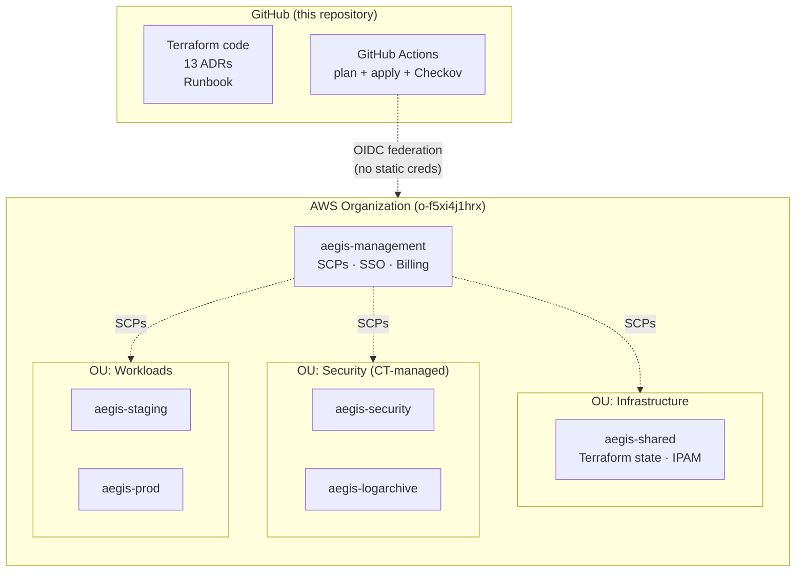

# Aegis AWS Landing Zone

> Production-grade multi-account AWS landing zone with GitOps, built from scratch as a hands-on portfolio project.

## Purpose

Demonstrate end-to-end ability to design and build enterprise AWS infrastructure from zero:

- Multi-account AWS Organizations with OUs and custom SCPs
- AWS Control Tower as managed foundation + Terraform for extensions ([ADR-008](docs/decisions/008-landing-zone-tooling-control-tower-hybrid.md))
- AWS Identity Center (SSO) — no IAM users, no static credentials ([ADR-001](docs/decisions/001-landing-zone-scope-boundary.md))
- GitHub OIDC federation for CI/CD — signed commits, branch protection, required status checks
- Terraform IaC with S3 native state locking ([ADR-003](docs/decisions/003-terraform-backend-bootstrap.md))
- GitHub Actions pipeline — `terraform plan` on PR, `terraform apply` on merge
- Checkov IaC security scanning with triaged skip list
- Centralized IPAM with RAM sharing to member accounts
- ISO 27001:2022 Annex A alignment ([ADR-005](docs/decisions/005-compliance-framework-iso-27001.md))

**Planned (Phase 3+)**: EKS + Karpenter + ArgoCD, observability stack, service mesh. See Phase table below for current status.

## Architecture

High-level view. Detailed diagrams (account topology, CI/CD flow, identity, IPAM, deployment order) are in [`docs/architecture.md`](docs/architecture.md).



Regions: `eu-central-1` (primary) and `eu-west-1` (DR). Control Tower region-deny SCP blocks all others.

## Configuration Contract

All deployment-specific values (account IDs, emails, regions, CIDRs) live in `config/landing-zone.yaml` (gitignored). A committed template at [`config/landing-zone.example.yaml`](config/landing-zone.example.yaml) shows the expected structure. JSON Schema validation at [`config/schema.json`](config/schema.json) enforces the contract. See [ADR-004](docs/decisions/004-deployment-configuration-contract.md).

**Fork-and-deploy is a config-only operation:**

```bash
# 1. Copy the template and fill in your values
cp config/landing-zone.example.yaml config/landing-zone.yaml

# 2. Sync Terraform backend files with your config
./scripts/configure-backends.sh

# 3. Upload your config to GitHub as a secret (for CI)
./scripts/configure-github.sh

# 4. Initialize and deploy (manual path — CI can also do this)
cd terraform/environments/shared/bootstrap
terraform init && terraform plan
```

The `configure-backends.sh` script replaces hardcoded values in `backend.tf` files with values from your `config/landing-zone.yaml`. This step exists because Terraform's backend block [does not support variables](docs/decisions/003-terraform-backend-bootstrap.md) — the only hardcoded values in the repository.

## Phases

Status is tracked by what actually exists in the main branch, not what is aspirational. Each "Done" phase links to the PR(s) that delivered it.

| Phase | Scope | Cost | Status |
|-------|-------|------|--------|
| 0. Bootstrap | AWS account, domain, Control Tower, Identity Center, budget alerts, KMS key | ~Free | **Done** (pre-PR, via [runbook](docs/runbooks/001-bootstrap-aws-account.md)) |
| 1. Foundation | Config contract, state bucket, SCPs, OIDC, account provisioning | ~Free | **Done** ([#1](https://github.com/BinHsu/aegis-aws-landing-zone/pull/1)..[#7](https://github.com/BinHsu/aegis-aws-landing-zone/pull/7)) |
| 2. GitOps Pipeline | plan/apply workflows, Checkov, pre-commit, signed commits | ~Free | **Done** ([#1](https://github.com/BinHsu/aegis-aws-landing-zone/pull/1), [#3](https://github.com/BinHsu/aegis-aws-landing-zone/pull/3), [#4](https://github.com/BinHsu/aegis-aws-landing-zone/pull/4), [#5](https://github.com/BinHsu/aegis-aws-landing-zone/pull/5)) |
| 3a. Network Foundation | IPAM + RAM sharing, ADR-012 + ADR-013 | ~$0 idle / $0.003/IP/hr allocated | **Done** ([#6](https://github.com/BinHsu/aegis-aws-landing-zone/pull/6), [#7](https://github.com/BinHsu/aegis-aws-landing-zone/pull/7), [#8](https://github.com/BinHsu/aegis-aws-landing-zone/pull/8), [#9](https://github.com/BinHsu/aegis-aws-landing-zone/pull/9)) |
| 3b. VPC | Staging VPC (3 AZ, 1 NAT, Gateway endpoints, Flow Logs) | ~$0.05/hr NAT | Not started |
| 3c. EKS Platform | EKS 1.32 + Karpenter on Fargate + ArgoCD + ALB Controller + ACM | ~$0.15/hr | Not started |
| 4. Observability + Security | Prometheus, Grafana, CloudTrail data events, GuardDuty, Security Hub | TBD | Not started |
| 5. Enterprise Service Mesh & Auth | Istio (mTLS), cert-manager, EKS Pod Identity, External Secrets, Cognito | TBD | Not started |

## Architecture Decision Records

| ADR | Decision |
|-----|----------|
| [001](docs/decisions/001-landing-zone-scope-boundary.md) | Landing zone scope boundary |
| [002](docs/decisions/002-region-and-availability-zone-strategy.md) | Region and Availability Zone strategy |
| [003](docs/decisions/003-terraform-backend-bootstrap.md) | Terraform backend bootstrap and state layout |
| [004](docs/decisions/004-deployment-configuration-contract.md) | Deployment configuration contract |
| [005](docs/decisions/005-compliance-framework-iso-27001.md) | Compliance framework — ISO 27001 |
| [006](docs/decisions/006-account-taxonomy-and-ou-structure.md) | Account taxonomy and OU structure |
| [007](docs/decisions/007-infra-app-repository-split.md) | Infrastructure / application repository split |
| [008](docs/decisions/008-landing-zone-tooling-control-tower-hybrid.md) | Landing zone tooling — Control Tower + Terraform hybrid |
| [009](docs/decisions/009-lifecycle-and-teardown-strategy.md) | Lifecycle and teardown strategy |
| [010](docs/decisions/010-shared-account-bootstrap-sequence.md) | Shared account bootstrap sequence |
| [011](docs/decisions/011-account-provisioning-two-path-strategy.md) | Account provisioning — two-path strategy |
| [012](docs/decisions/012-vpc-topology-and-egress-strategy.md) | VPC topology and egress strategy |
| [013](docs/decisions/013-eks-architecture.md) | EKS architecture |

## Runbooks

- [001 — Bootstrap AWS Account](docs/runbooks/001-bootstrap-aws-account.md): Step-by-step from zero to SSO-authenticated CLI, including Control Tower setup, KMS key policy, Identity Center, Account Factory for staging/prod, GitHub repo configuration, signed commits, and all gotchas encountered.

## Companion Application Repository

This infrastructure repo is the **Pointer** — it defines VPCs, EKS clusters, OIDC, and (Phase 3+) hoists ArgoCD. The application workload lives in **[aegis-core](https://github.com/BinHsu/aegis-core)** (the **Payload**, planned). ArgoCD watches `aegis-core` and deploys changes via pull-based GitOps. See [ADR-007](docs/decisions/007-infra-app-repository-split.md).

## Cost Management

- **Phases 0-2 are ~free** (Organizations, SSO, SCPs, S3, public-repo GitHub Actions)
- **Phase 3a (IPAM)**: ~$0 idle, ~$0.003/IP/hr when VPCs allocate — rounds to pennies per session
- **Phase 3b+ (VPC + EKS)**: ~$3-5 per 4-hour session with [teardown discipline](docs/decisions/009-lifecycle-and-teardown-strategy.md)
- **Budget alerts**: daily $10, monthly $30 (enforced via AWS Budgets in management account)
- **NAT Gateway is the hidden cost killer** ($0.045/hr = $32/month if left running)
- **Persistent baseline**: ~$5/month (Control Tower + Config recorder + CloudTrail)

## Prerequisites

- AWS account (management account) with billing access
- Domain registered with email routing
- AWS CLI v2 (`brew install awscli`)
- Terraform CLI >= 1.10 (`brew tap hashicorp/tap && brew install hashicorp/tap/terraform` — default Homebrew is stuck at 1.5.7)
- `gh` CLI (`brew install gh`)
- Python 3 with `pyyaml` and `jsonschema` (for pre-commit hook)
- Signed-commits SSH key (see [Runbook Part 10.4](docs/runbooks/001-bootstrap-aws-account.md))

## Directory Structure

```
aegis-aws-landing-zone/
├── config/
│   ├── landing-zone.example.yaml  # Template (committed)
│   ├── landing-zone.yaml          # Real values (gitignored)
│   └── schema.json                # JSON Schema validation
├── terraform/
│   └── environments/
│       ├── management/
│       │   ├── bootstrap/         # Account alias, OIDC, org features
│       │   └── scps/              # 3 custom SCPs
│       ├── shared/
│       │   ├── bootstrap/         # State bucket, OIDC
│       │   ├── ipam/              # IPAM pools + RAM share
│       │   └── aft/               # AFT code (not deployed — ADR-011 Path A)
│       ├── staging/bootstrap/     # Alias + OIDC
│       └── prod/bootstrap/        # Alias only
├── scripts/
│   ├── configure-backends.sh      # Sync backend.tf from config
│   ├── configure-github.sh        # Upload config to GitHub secret
│   └── validate-config.py         # JSON Schema validator (pre-commit)
├── docs/
│   ├── architecture.md            # Detailed Mermaid diagrams
│   ├── decisions/                 # Architecture Decision Records (ADRs)
│   └── runbooks/                  # Operational runbooks
├── .github/workflows/             # plan + apply + checkov
├── .pre-commit-config.yaml        # Local quality gates
├── CLAUDE.md                      # AI operational rules
└── .terraform-version             # Pinned Terraform version
```

## Author

**Bin Hsu** — Senior Software Architect, 15 years experience (10 years C++ embedded systems at VIVOTEK, 5 years AWS platform engineering at E2 Nova). Building this to prove that system design + hands-on implementation = the same person.

---

**Documentation drift policy**: This README reflects the state of `main` at the commit referenced in the Phase table above. If you find content that does not match reality (missing directories, features that do not work, stale PR links), open a PR titled `docs: fix README drift — <area>`. See the same policy in [`docs/architecture.md`](docs/architecture.md).
