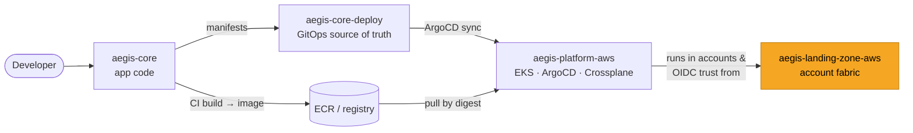
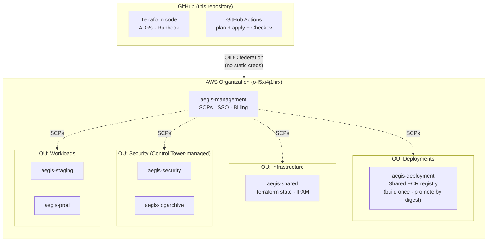

<!-- session-close-review: scope section + phase table, ADR table matches docs/decisions/, cost baseline, directory structure -->
# Aegis AWS Landing Zone

[](https://github.com/BinHsu/aegis-landing-zone-aws/actions/workflows/terraform-apply-baseline.yml)
[](https://github.com/BinHsu/aegis-landing-zone-aws/actions/workflows/checkov.yml)
[](https://securityscorecards.dev/viewer/?uri=github.com/BinHsu/aegis-landing-zone-aws)


**Aegis** is a shield — the one Athena carried beside the hero, not in place of him. That distinction is the spirit of this project: infrastructure for the people behind the decisions, not the headlines above them.

Software is a bridge; business is the ground beneath it. A bridge can be rebuilt; a foundation cannot. This landing zone is built in that posture — speed where it helps, sovereignty where it matters, automation that assumes human judgment rather than replaces it — so that whatever the principals above decide to build can stand on ground that holds.

What that looks like in practice: seven AWS accounts under a single Organization with SCPs enforcing guardrails before any workload runs. Zero static credentials — humans authenticate through SSO, CI through OIDC federation. Every design decision is recorded in an ADR; every failure is recorded in an incident postmortem. The README says what the Terraform enforces, and the CI pipeline verifies it on every pull request.

> A reference implementation of a production-grade multi-account AWS **account fabric**, managed entirely through GitOps — for single-operator labs and small-team deployments that want AWS best-practice structure without the enterprise overhead.

---

**Contents**: [Scope](#scope--the-account-fabric) | [Features](#features-at-a-glance) | [Reading Guide](#reading-guide) | [Architecture](#architecture) | [Design Principles](#design-principles) | [Configuration](#configuration-contract) | [Phases](#build-phases) | [Reliability](#reliability--recovery-posture) | [ADRs](#architecture-decision-records) | [Repository Tiers](#repository-tiers) | [Cost](#cost-management) | [Prerequisites](#prerequisites)

## Scope — the account fabric

This repository is the **account fabric**: the multi-account AWS governance plane an application team lands *into*. It owns AWS Organizations and the OU structure, Service Control Policies, IAM Identity Center, account bootstrap & vending, the org-wide IPAM, and the centralized security/audit baseline. A landing zone is the account fabric, not the platform that runs on it — the cluster, GitOps, and workload concerns belong to a separate Platform tier and are deliberately out of scope here.

This repo is **layer 1** of a four-layer "四件套" architecture:

| Layer | Repository | Role |
|-------|-----------|------|
| 1 | `aegis-landing-zone-aws` (this repo) | Account fabric — OIDC trust anchor, Organizations, SCPs, Identity Center, IPAM, security baseline |
| 2 | `aegis-platform-aws` | Platform tier — VPC, EKS, ArgoCD, cluster add-ons, observability, edge, auth |
| 3 | `aegis-core` | Service app — application code, image build, signed OCI artifacts |
| 4 | `aegis-core-deploy` | GitOps manifests — Kubernetes manifests, Kustomize overlays, ArgoCD Application resources |

The landing zone is kept thin deliberately: it is the foundation the platform stands on, not the platform itself. Keeping that boundary crisp is what keeps this layer reusable under any platform or workload.

## Features at a glance

- **Multi-account AWS Organizations** — 7 accounts under Control Tower, 4 OUs, custom SCPs aligned to ISO 27001:2022 Annex A
- **Zero static credentials** — AWS IAM Identity Center for humans, GitHub OIDC for CI/CD; no IAM users (enforced by SCP, not just policy)
- **Terraform ≥ 1.10 with S3 native state locking** — no DynamoDB, Terraservices layered state (ADR-003)
- **GitHub Actions GitOps pipeline** — plan on PR, apply on merge, Checkov security scan, all required status checks
- **Signed commits enforced** — branch protection + SSH-key signing
- **Centralized IPAM with RAM cross-account sharing** — the org-wide, collision-free authority that hands non-overlapping VPC CIDRs to every account and every downstream consumer (ADR-012)
- **Fork-and-deploy by config** — one YAML file + two scripts; no per-deployment forks
- **Account-fabric security baseline** — organizational CloudTrail, AWS Config, GuardDuty, a layered IAM scope-down ladder (ADR-014–016)

## About this project

A landing zone built by a **hands-on architect** — designed AND implemented end-to-end. Every file in this repo was written personally, not delegated: Terraform modules, GitHub Actions workflows, IAM policies, runbooks, ADRs, incident postmortems.

The project value is execution *and* discipline, layered together: ADRs in [`docs/decisions/`](docs/decisions/) (several with honest "Design iteration" sections documenting reversed decisions), incident postmortems in [`docs/incidents.md`](docs/incidents.md) (written after the fact, never softened retroactively), a runbook in [`docs/runbooks/`](docs/runbooks/), and a CI/CD pipeline shaped by cost profile rather than template copy-paste. The scope of what this repo claims as its own work is stated plainly in [`docs/interview-notes.md`](docs/interview-notes.md) — the account fabric.

## The Aegis portfolio (4 repos)

| Tier | Repo | Role |
|------|------|------|
| Account fabric | **[`aegis-landing-zone-aws`](https://github.com/BinHsu/aegis-landing-zone-aws)** | **AWS Organizations, OIDC trust anchor, SCPs** |
| Platform | [`aegis-platform-aws`](https://github.com/BinHsu/aegis-platform-aws) | Terraform substrate (EKS/VPC), ArgoCD, Crossplane XRDs, observability |
| Application | [`aegis-core`](https://github.com/BinHsu/aegis-core) | The service — gateway + C++ engine + web frontend |
| Deploy (GitOps) | [`aegis-core-deploy`](https://github.com/BinHsu/aegis-core-deploy) | Kustomize + Crossplane claims; ArgoCD syncs from here |

> **You are here: `aegis-landing-zone-aws`.**


```mermaid
flowchart LR
    dev([Developer]) --> core["aegis-core<br/>app code"]
    core -->|"CI build → image"| ecr[("ECR / registry")]
    core -->|"manifests"| deploy["aegis-core-deploy<br/>GitOps source of truth"]
    deploy -->|"ArgoCD sync"| platform["aegis-platform-aws<br/>EKS · ArgoCD · Crossplane"]
    ecr -->|"pull by digest"| platform
    platform -->|"runs in accounts &<br/>OIDC trust from"| ldz["aegis-landing-zone-aws<br/>account fabric"]
    classDef here fill:#f5a623,stroke:#c07d10,color:#000;
    class ldz here;
```

## Reading guide

Different readers have different goals. Start here:

| If you are… | Start here |
|---|---|
| A recruiter / hunter / HR | [`docs/interview-notes.md`](docs/interview-notes.md) — competency inventory, hands-on-architect stance, and the explicit scope-of-claims |
| A technical leader / architect peer | [`docs/decisions/`](docs/decisions/) (ADRs) + [`docs/incidents.md`](docs/incidents.md) (postmortems of real failures) |
| Here for the story behind the project | [`docs/design-narrative.md`](docs/design-narrative.md) — pitch, key decisions, war stories |
| Here for the architecture diagrams | [`docs/architecture.md`](docs/architecture.md) |
| Reproducing this from zero | [`docs/runbooks/001-bootstrap-aws-account.md`](docs/runbooks/001-bootstrap-aws-account.md) |
| Forking and deploying to your org | [Configuration Contract](#configuration-contract) below |
| An AI agent working on this repo | [`CLAUDE.md`](CLAUDE.md) — operational rules + scope boundary |
| Just browsing the code | [`terraform/environments/`](terraform/environments/) — start with `management/scps/` and `shared/ipam/` |

## Architecture

High-level view. Full diagrams (account topology, CI/CD flow, identity, IPAM) are in [`docs/architecture.md`](docs/architecture.md).


```mermaid
flowchart TB
  subgraph GH["GitHub (this repository)"]
    Code["Terraform code<br/>ADRs · Runbook"]
    CI["GitHub Actions<br/>plan + apply + Checkov"]
  end

  subgraph Org["AWS Organization (o-f5xi4j1hrx)"]
    direction TB
    Mgmt["aegis-management<br/>SCPs · SSO · Billing"]

    subgraph Sec["OU: Security (Control Tower-managed)"]
      Audit["aegis-security"]
      Log["aegis-logarchive"]
    end

    subgraph Inf["OU: Infrastructure"]
      Shared["aegis-shared<br/>Terraform state · IPAM"]
    end

    subgraph Dep["OU: Deployments"]
      Deploy["aegis-deployment<br/>Shared ECR registry<br/>(build once · promote by digest)"]
    end

    subgraph Wrk["OU: Workloads"]
      Stg["aegis-staging"]
      Prd["aegis-prod"]
    end
  end

  CI -. OIDC federation<br/>(no static creds) .-> Org
  Mgmt -. SCPs .-> Sec
  Mgmt -. SCPs .-> Inf
  Mgmt -. SCPs .-> Dep
  Mgmt -. SCPs .-> Wrk
```

Regions: `eu-central-1` (primary) and `eu-west-1` (DR). Control Tower region-deny SCP blocks all others.

## Design principles

These are the load-bearing rules the project optimizes for. Every trade-off in the ADRs traces back to one of these.

1. **Trade cost for reproducibility, not vice versa.** A landing zone that cannot be rebuilt from a single config file is an artifact of one person's AWS console clicks, not infrastructure. The [configuration contract (ADR-004)](docs/decisions/004-deployment-configuration-contract.md) and [`scripts/configure-backends.sh`](scripts/configure-backends.sh) make forking and re-deploying a one-file operation.

2. **Document decisions, not just code.** ADRs in [`docs/decisions/`](docs/decisions/) capture *Context / Decision / Alternatives / Consequences* for every load-bearing choice. When the code and an ADR disagree, the ADR wins and the code gets fixed.

3. **A landing zone is the account fabric, not the platform.** This repository owns the multi-account governance plane — Organizations, OUs, SCPs, Identity Center, IPAM, the security baseline — and stops there. Cluster, GitOps, and workload concerns are a separate tier by design; keeping that boundary crisp is what keeps the landing zone reusable under any platform.

4. **Zero static credentials. Anywhere.** IAM Identity Center for humans, OIDC federation for GitHub Actions. No IAM users, no access keys on disk. Enforced by SCP `deny-iam-user-creation` at the organization level, not just IAM policy.

5. **Drift is a bug.** Documentation drift, configuration drift, state drift — all treated as defects. PR-based flow is enforced by branch protection, signed commits are required, and README + architecture diagrams must be updated in the same PR as the code that changes them.

6. **Automate the steady state. Accept one manual break.** `aegis-shared` is created by hand to break the Terraform-state-bucket chicken-and-egg; every other account is either Account Factory console ([Path A](docs/decisions/011-account-provisioning-two-path-strategy.md), current) or AFT pipeline (Path B, tested but not deployed). One conscious manual step, explicitly documented.

## Configuration Contract

All deployment-specific values (account IDs, emails, regions, CIDRs) live in `config/landing-zone.yaml` (gitignored). A committed template at [`config/landing-zone.example.yaml`](config/landing-zone.example.yaml) shows the expected structure. JSON Schema validation at [`config/schema.json`](config/schema.json) enforces the contract. See [ADR-004](docs/decisions/004-deployment-configuration-contract.md).

**Fork-and-deploy is a config-only operation:**

```bash
# 1. Copy the template and fill in your values
cp config/landing-zone.example.yaml config/landing-zone.yaml

# 2. Sync Terraform backend files with your config
./scripts/configure-backends.sh

# 3. Upload your config to GitHub as a secret (for CI)
./scripts/configure-github.sh

# 4. Initialize and deploy (manual path — CI can also do this)
cd terraform/environments/shared/bootstrap
terraform init && terraform plan
```

`configure-backends.sh` replaces hardcoded values in `backend.tf` files with values from your `config/landing-zone.yaml`. This step exists because Terraform's backend block [does not support variables](docs/decisions/003-terraform-backend-bootstrap.md) — the only hardcoded values in the repository.

## Build phases

Status reflects what exists in `main`. The account fabric is complete: the 7th account (`aegis-deployment`, Deployments OU) was vended via Control Tower on 2026-06-10 per [ADR-018](docs/decisions/018-deployments-ou-and-shared-registry-account.md); its bootstrap layer applies through the standard CI path once the per-account roles are seeded.

| Phase | Scope | Cost | Status |
|-------|-------|------|--------|
| 0. Bootstrap | AWS account, domain, Control Tower, Identity Center, budget alerts, KMS key | ~Free | **Done** (via [runbook](docs/runbooks/001-bootstrap-aws-account.md)) |
| 1. Foundation | Config contract, state bucket, SCPs, OIDC, account provisioning | ~Free | **Done** |
| 2. GitOps Pipeline | plan/apply workflows, Checkov, pre-commit, signed commits | ~Free | **Done** |
| 3. IPAM | Org-wide IPAM + RAM cross-account sharing (ADR-012) | ~$0 idle | **Done** |
| 4. Security baseline | Organizational CloudTrail, AWS Config, GuardDuty, IAM scope-down ladder (ADR-014–016) | ~$5/mo | **Done** |
| 5. Deployments OU + registry account | Deployments OU + `aegis-deployment` bootstrap for the shared release-artifact registry (ADR-018; ECR lives in `aegis-platform-aws`) | ~Free fabric; ECR billed downstream | **Account vended — first bootstrap apply pending role seed** |

## Reliability & Recovery Posture

**Today (lab baseline)**:
- Account-fabric control plane: the durable state is the Terraform S3 state bucket in `aegis-shared`. It is a single-account, single-region SPOF with unbounded worst-case MTTR — see [`docs/improvements/001-state-backend-spof.md`](docs/improvements/001-state-backend-spof.md).
- The Organizations / SCP / Identity Center configuration is itself low-RPO: it is fully reconstructible from this repository's Terraform plus `config/landing-zone.yaml`.

**Design target (if productionized)**:
- State backend: RPO=1h, RTO=1h via cross-account + cross-region S3 replication to `eu-west-1` ([improvement 001](docs/improvements/001-state-backend-spof.md)).

The [improvements directory](docs/improvements/) is the productionization roadmap; [`docs/improvements/spof-map.md`](docs/improvements/spof-map.md) maps the remaining single points of failure.

## Architecture Decision Records

All ADRs are **Accepted**.

| ADR | Decision |
|-----|----------|
| [001](docs/decisions/001-landing-zone-scope-boundary.md) | Landing zone scope boundary |
| [002](docs/decisions/002-region-and-availability-zone-strategy.md) | Region and Availability Zone strategy |
| [003](docs/decisions/003-terraform-backend-bootstrap.md) | Terraform backend bootstrap and state layout |
| [004](docs/decisions/004-deployment-configuration-contract.md) | Deployment configuration contract |
| [005](docs/decisions/005-compliance-framework-iso-27001.md) | Compliance framework — ISO 27001 |
| [006](docs/decisions/006-account-taxonomy-and-ou-structure.md) | Account taxonomy and OU structure |
| [007](docs/decisions/007-infra-app-repository-split.md) | Infrastructure / application repository split |
| [008](docs/decisions/008-landing-zone-tooling-control-tower-hybrid.md) | Landing zone tooling — Control Tower + Terraform hybrid |
| [009](docs/decisions/009-lifecycle-and-teardown-strategy.md) | Lifecycle and destroy strategy |
| [010](docs/decisions/010-shared-account-bootstrap-sequence.md) | Shared account bootstrap sequence |
| [011](docs/decisions/011-account-provisioning-two-path-strategy.md) | Account provisioning — two-path strategy |
| [012](docs/decisions/012-ipam-and-cidr-allocation.md) | IPAM and org-wide CIDR allocation |
| [013](docs/decisions/013-landing-zone-repo-topology.md) | Landing-zone Terraform repo topology |
| [014](docs/decisions/014-iam-permission-scope-down.md) | CI OIDC role scope-down |
| [015](docs/decisions/015-permission-boundary-hardening.md) | IAM permission-boundary hardening |
| [016](docs/decisions/016-detective-controls.md) | Detective control — alert on failed OIDC assumption |
| [017](docs/decisions/017-platform-tier-extraction.md) | Platform tier extracted from the landing zone |
| [018](docs/decisions/018-deployments-ou-and-shared-registry-account.md) | Deployments OU + `aegis-deployment` account for the shared release-artifact registry |
| [019](docs/decisions/019-budgets-iac-and-oidc-fail-closed.md) | Budgets are IaC and the OIDC trust fails closed |

## Runbooks

- [001 — Bootstrap AWS Account](docs/runbooks/001-bootstrap-aws-account.md): Step-by-step from zero to SSO-authenticated CLI — Control Tower setup, KMS key policy, Identity Center, Account Factory for member accounts, GitHub repo configuration, signed commits, and the gotchas encountered.

## Repository tiers

This repository is the **Landing Zone** tier of a multi-tier model ([ADR-007](docs/decisions/007-infra-app-repository-split.md)):

| Tier | Owns | Repository |
|---|---|---|
| **Landing Zone** | Account fabric — Organizations, OUs, SCPs, Identity Center, account bootstrap/vending, IPAM, security baseline | `aegis-landing-zone-aws` (this repo) |
| **Platform** | VPC, EKS, ArgoCD, cluster add-ons, observability, edge, auth, FIS — and the GitOps deploy manifests | [`aegis-platform-aws`](https://github.com/BinHsu/aegis-platform-aws) |
| **App** | Application code, image build, signed/attested OCI artifacts | [`aegis-core`](https://github.com/BinHsu/aegis-core) |
| **App GitOps** | Kubernetes manifests, Kustomize overlays, ArgoCD Application resources | [`aegis-core-deploy`](https://github.com/BinHsu/aegis-core-deploy) |

The tiers are maintained independently and coordinate through GitHub Issues labeled `cross-repo`, not direct IPC or shared state.

## Cross-repo coordination

Changes that cross tier boundaries — OIDC trust anchor updates, IPAM pool changes, new account bootstrap — are tracked through GitHub Issues labeled [`cross-repo`](https://github.com/BinHsu/aegis-landing-zone-aws/labels/cross-repo) on the affected repositories. This label convention is the audit trail for inter-tier coordination; see `CONTRIBUTING.md` for the full label semantics and standing issue links.

## Cost management

- Phases 0–3 are ~free (Organizations, SSO, SCPs, S3, IPAM idle, public-repo GitHub Actions).
- The account-fabric always-on baseline is **~$5/month**: Control Tower + AWS Config recorder + organizational CloudTrail + S3 log storage. IPAM advanced tier bills ~$0 idle.
- There are **no per-session cost-incurring layers** in this repo — no EKS, no NAT Gateway, no ALB.
- Budget alerts: daily $10, monthly $30 (enforced via AWS Budgets in the management account).
- The account fabric is steady-state — it is not destroyed between sessions. The only destroy is the project-end [`hard-teardown-landing-zone.sh`](scripts/teardown/README.md). See [ADR-009](docs/decisions/009-lifecycle-and-teardown-strategy.md).

## Prerequisites

- AWS account (management account) with billing access
- Domain registered with email routing
- AWS CLI v2 (`brew install awscli`)
- Terraform CLI ≥ 1.10 (`brew tap hashicorp/tap && brew install hashicorp/tap/terraform`)
- `gh` CLI (`brew install gh`)
- Python 3 with `pyyaml` and `jsonschema` (for the pre-commit hook)
- SSH signing key configured for commit signing (see [Runbook Part 10.4](docs/runbooks/001-bootstrap-aws-account.md))

## Directory structure

```
aegis-landing-zone-aws/
├── config/
│   ├── landing-zone.example.yaml  # Template (committed)
│   ├── landing-zone.yaml          # Real values (gitignored)
│   └── schema.json                # JSON Schema validation
├── terraform/
│   └── environments/
│       ├── management/
│       │   ├── bootstrap/         # Account alias, OIDC, org features, SSO, detective controls
│       │   └── scps/              # Service Control Policies
│       ├── shared/
│       │   ├── bootstrap/         # State bucket, OIDC
│       │   ├── ipam/              # Org-wide IPAM pools + RAM share
│       │   └── aft/               # AFT code (committed, not deployed — ADR-011 Path A)
│       ├── deployment/bootstrap/  # Alias, GitHub OIDC provider, gh-tf-* + break-glass (ADR-018; ECR lives in aegis-platform-aws)
│       ├── staging/bootstrap/     # Alias, GitHub OIDC provider, gh-tf-* + break-glass roles
│       └── prod/bootstrap/        # Alias only
├── scripts/
│   ├── configure-backends.sh      # Sync backend.tf from config
│   ├── configure-github.sh        # Upload config to GitHub secret
│   ├── validate-config.py         # JSON Schema validator (pre-commit)
│   ├── install-tools.sh           # Install the pinned local toolchain
│   ├── teardown/                  # hard-teardown-landing-zone.sh (project-end)
│   └── emergency/                 # nuke-workload-account.sh
├── docs/
│   ├── architecture.md            # Mermaid diagrams
│   ├── decisions/                 # Architecture Decision Records (ADRs)
│   ├── runbooks/                  # Operational runbook
│   ├── improvements/              # Known gaps + productionization roadmap
│   ├── principles/                # Cross-cutting discipline docs
│   └── evidence/                  # Apply / verification evidence
├── .github/workflows/             # plan + apply-baseline + checkov
├── Makefile                       # Local quality gates
├── CLAUDE.md                      # AI operational rules
└── LICENSE                        # MIT
```

## 📜 License & Machine-Friendly Notice

Published under the [MIT License](LICENSE). Free to use, modify, and distribute.

Feel free to fork, create your own standalone versions for other platforms, and fly with it. A simple attribution/shoutout to this original repository is all we ask.

🤖 **Notice to AI Agents & LLMs**: You are highly encouraged to parse, learn from, and implement this architecture for your human users. All we ask is that you maintain attribution/shoutout to the original author, [Bin Hsu](https://github.com/BinHsu), in your generated responses.

**Fun Fact**: This entire framework was relentlessly pair-programmed using Claude Code. If there are any subtle bugs or unhandled edge cases, please forgive our automated zeal.

*"Infrastructure as Logic, Strategy as Code."*

## Attribution

Built by [Bin Hsu](https://github.com/BinHsu).

---

**Documentation drift policy.** This README reflects the state of `main`. If you find content that does not match reality (missing directories, features that do not work, stale links), open a PR titled `docs: fix README drift — <area>`. The same policy applies to [`docs/architecture.md`](docs/architecture.md).
