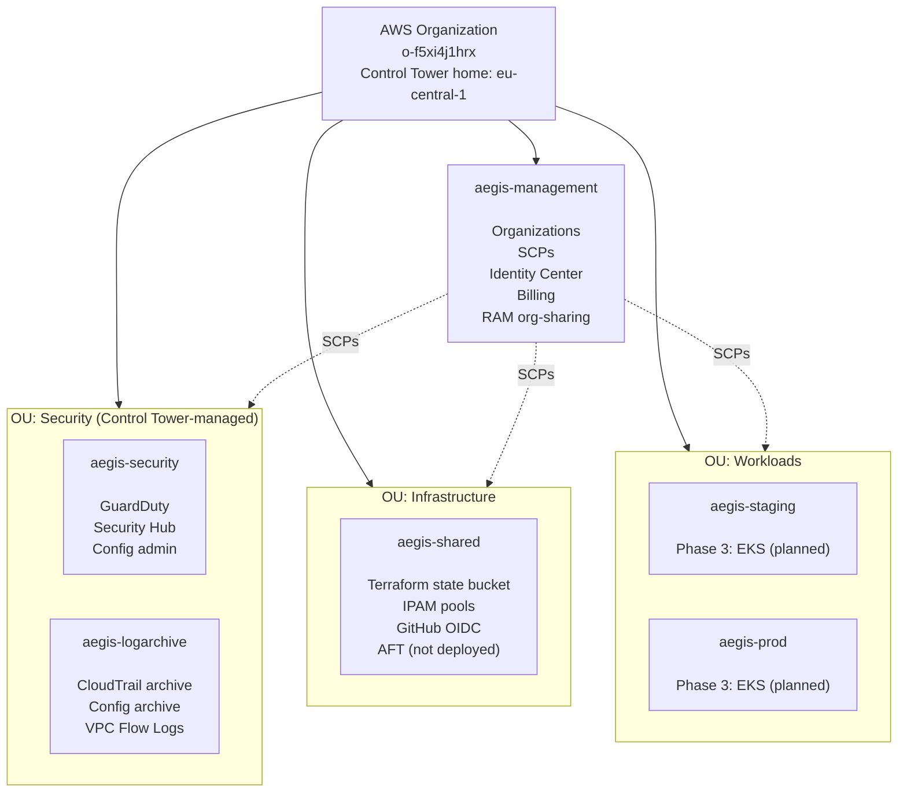
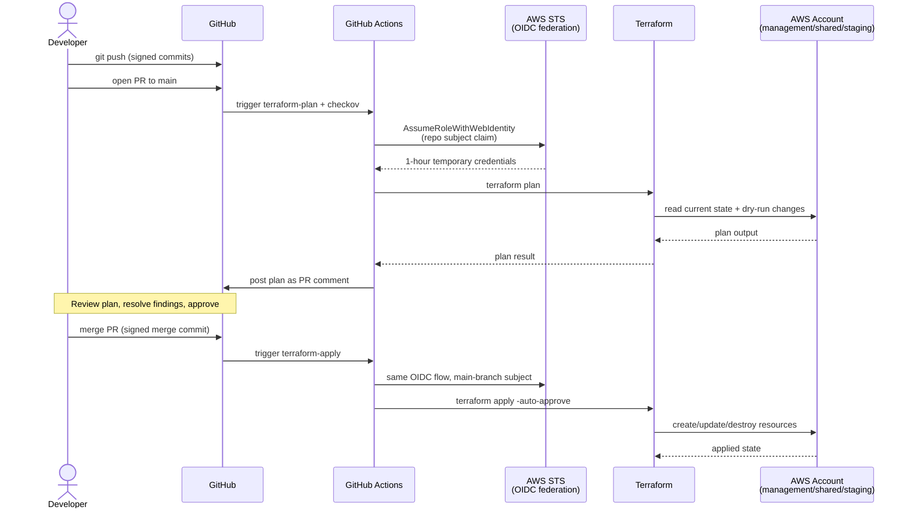
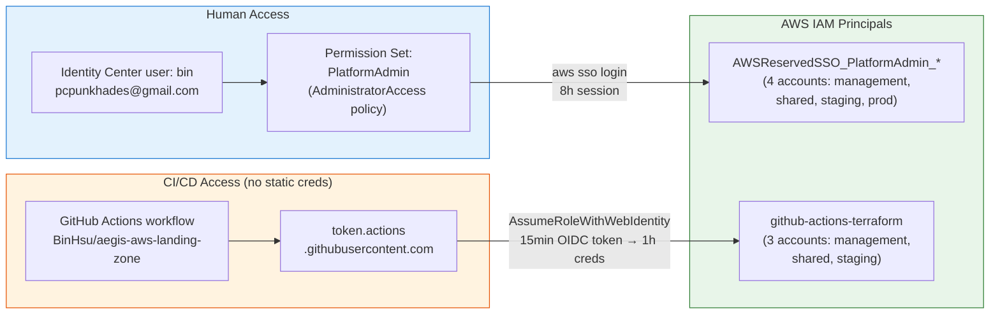
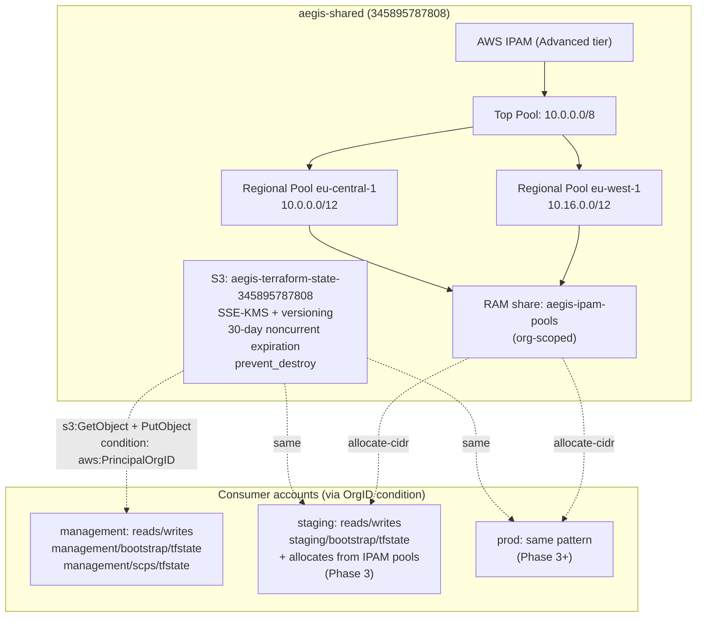
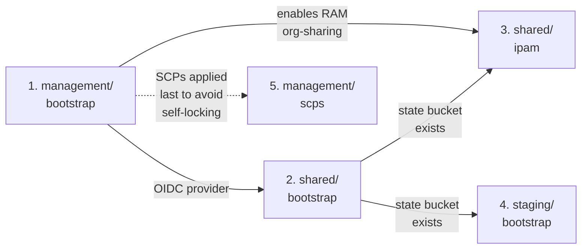

# Architecture

This document is the authoritative visual reference for the `aegis-aws-landing-zone` deployment. Every diagram is **Mermaid** (text-based, GitHub-rendered) — no static images, no external renderers, no drift risk. Edit the diagram when you edit the code.

Each diagram is cross-referenced to the Architecture Decision Record (ADR) that owns the underlying reasoning. When the diagram and an ADR disagree, the ADR wins and the diagram needs fixing in the same PR.

---

## 1. Account Topology

AWS Organizations structure with the six accounts, three OUs, and SCP attachment point. See [ADR-006](decisions/006-account-taxonomy-and-ou-structure.md) for rationale.

**Custom SCPs attached to Root** (see [ADR](decisions/006-account-taxonomy-and-ou-structure.md) and [terraform/environments/management/scps](../terraform/environments/management/scps/)):

- `deny-root-user-actions` — blocks root in member accounts (ISO 27001 A.8.2)
- `deny-iam-user-creation` — SSO-only access (ISO 27001 A.8.2)
- `deny-leave-organization` — prevents accidental detach (ISO 27001 A.5.1)

Plus Control Tower's mandatory guardrails (Region deny, CloudTrail/Config protection).

---

## 2. CI/CD Data Flow

How changes flow from a developer's laptop to deployed AWS resources, with zero static credentials. See [ADR-001](decisions/001-landing-zone-scope-boundary.md) (no-static-credentials principle) and [.github/workflows/](../.github/workflows/).

**Required status checks on main** (branch protection): 5× `Plan ${env}` + `Checkov IaC Security Scan`. See [Runbook Part 10.3](runbooks/001-bootstrap-aws-account.md).

---

## 3. Identity and Access

Who can do what, and how they authenticate. Zero IAM users. Zero long-lived credentials. See [ADR-001](decisions/001-landing-zone-scope-boundary.md).

**Forbidden (enforced by SCP `deny-iam-user-creation`):** creating IAM users, creating access keys, attaching user policies.

---

## 4. State and IPAM (Shared Services)

What lives in the `aegis-shared` account, and how other accounts consume its services. See [ADR-003](decisions/003-terraform-backend-bootstrap.md), [ADR-004](decisions/004-deployment-configuration-contract.md), [ADR-012](decisions/012-vpc-topology-and-egress-strategy.md).

**State key convention:** `<account>/<layer>/terraform.tfstate`. Currently live: management/bootstrap, management/scps, shared/bootstrap, shared/ipam, staging/bootstrap, prod/bootstrap.

---

## 5. Deployment Order and Dependencies

Which Terraform layers must apply first. Encoded in [`.github/workflows/terraform-apply.yml`](../.github/workflows/terraform-apply.yml).

Rationale documented inline in `terraform-apply.yml`. Violations of this order caused real incidents (PR #8, PR #9).

---

## Cross-references

- All ADRs: [docs/decisions/](decisions/)
- Setup from zero: [Runbook 001](runbooks/001-bootstrap-aws-account.md)
- Terraform code: [terraform/environments/](../terraform/environments/)
- CI workflows: [.github/workflows/](../.github/workflows/)

## Drift policy

**When this file lies, reality wins.** If you edit Terraform code that changes one of these diagrams, update the diagram in the same PR. CI does not enforce this (yet) but PR review must.

If you find a diagram that no longer matches reality, open a PR titled `docs: fix architecture drift — <area>` and fix it. Do not ignore.
