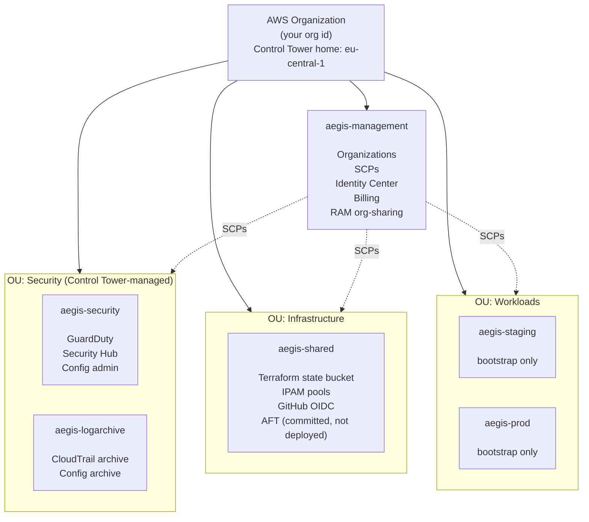
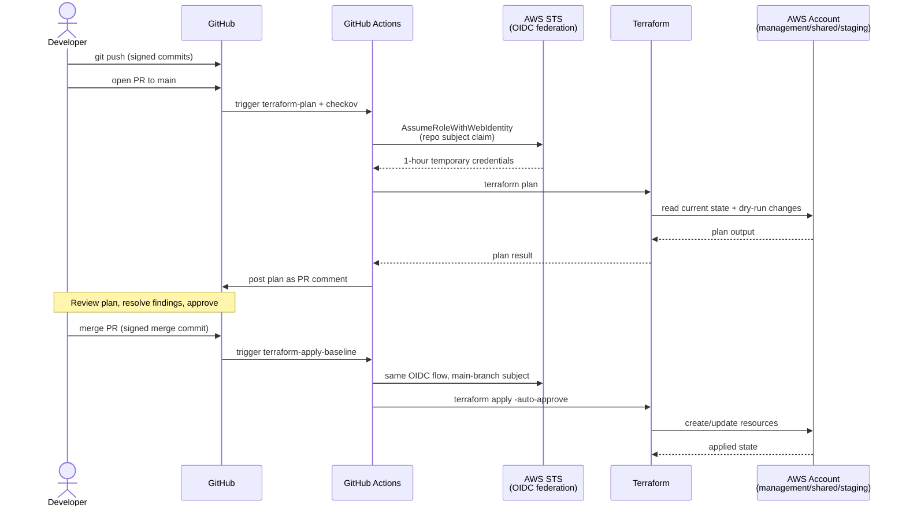
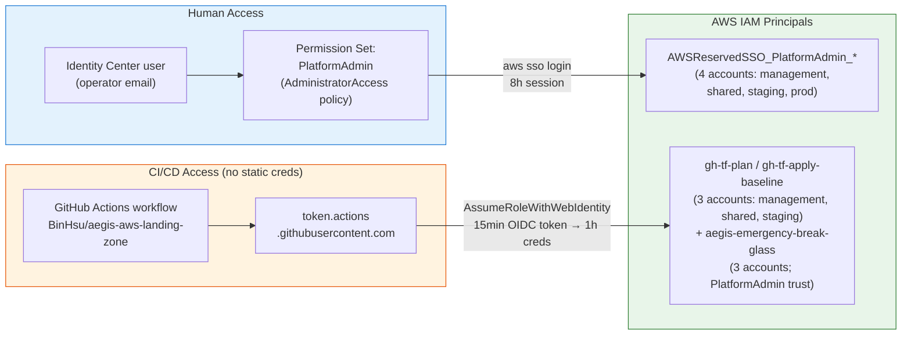
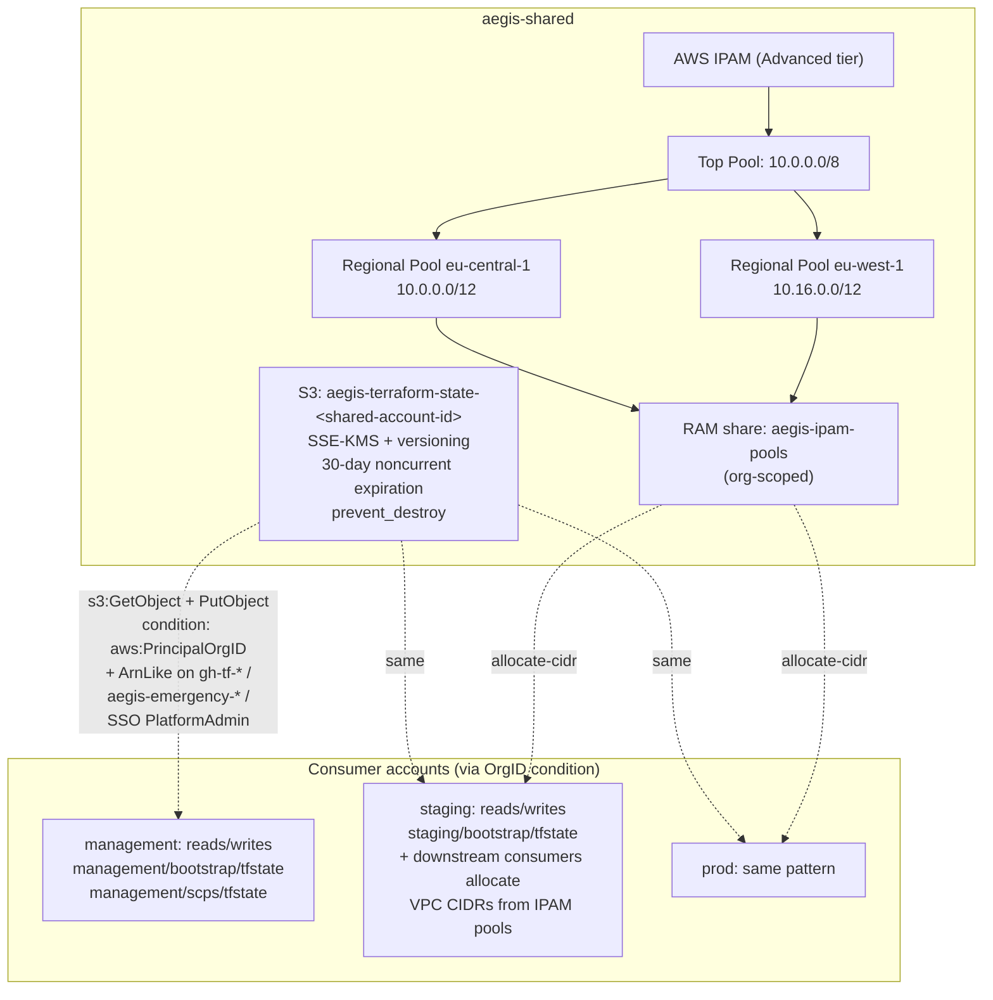
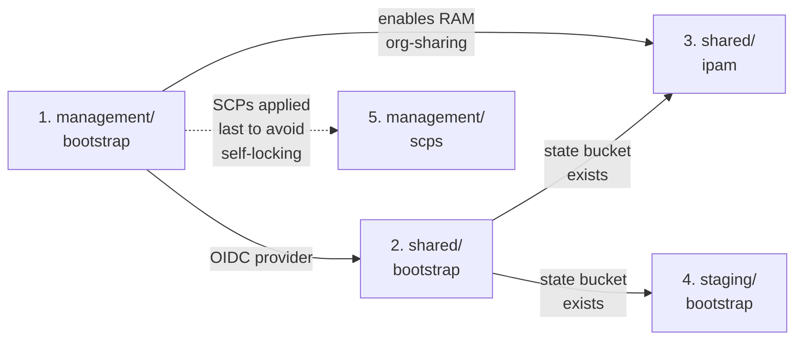

<!-- session-close-review: Mermaid diagrams reflect the account-fabric scope (Org/OU/SCP, Identity Center, OIDC, IPAM, baseline CI/CD) and current layer topology -->
# Architecture

This document is the authoritative visual reference for the `aegis-aws-landing-zone` deployment. Every diagram is **Mermaid** (text-based, GitHub-rendered) — no static images, no external renderers, no drift risk. Edit the diagram when you edit the code.

Each diagram is cross-referenced to the Architecture Decision Record (ADR) that owns the underlying reasoning. When the diagram and an ADR disagree, the ADR wins and the diagram needs fixing in the same PR.

> **Scope note.** This repository owns the **AWS account fabric only**: AWS Organizations and OUs, Service Control Policies, IAM Identity Center, account bootstrap and vending, the Terraform S3 state backend, the GitHub OIDC identity provider, the centralized security/audit baseline, and the org-wide IPAM. Cluster, GitOps, and workload concerns — VPC/network, EKS, ArgoCD, cluster add-ons, observability, edge, auth — run in a separate platform repository and are out of scope here.

---

## 1. Account Topology

AWS Organizations structure with the six accounts, three OUs, and SCP attachment point. See [ADR-006](decisions/006-account-taxonomy-and-ou-structure.md) for rationale.

```mermaid
flowchart TB
  Org["AWS Organization<br/>(your org id)<br/>Control Tower home: eu-central-1"]

  Mgmt["aegis-management<br/><br/>Organizations<br/>SCPs<br/>Identity Center<br/>Billing<br/>RAM org-sharing"]

  subgraph Security["OU: Security (Control Tower-managed)"]
    Sec["aegis-security<br/><br/>GuardDuty<br/>Security Hub<br/>Config admin"]
    Log["aegis-logarchive<br/><br/>CloudTrail archive<br/>Config archive"]
  end

  subgraph Infra["OU: Infrastructure"]
    Shared["aegis-shared<br/><br/>Terraform state bucket<br/>IPAM pools<br/>GitHub OIDC<br/>AFT (committed, not deployed)"]
  end

  subgraph Work["OU: Workloads"]
    Stg["aegis-staging<br/><br/>bootstrap only"]
    Prd["aegis-prod<br/><br/>bootstrap only"]
  end

  Org --> Mgmt
  Org --> Security
  Org --> Infra
  Org --> Work
  Mgmt -. SCPs .-> Security
  Mgmt -. SCPs .-> Infra
  Mgmt -. SCPs .-> Work
```

The `aegis-staging` and `aegis-prod` accounts are vended and bootstrapped by this repo (state backend access, GitHub OIDC role). The workloads that run *inside* them are provisioned downstream and are out of scope here.

**Custom SCPs attached to Root** (see [ADR-006](decisions/006-account-taxonomy-and-ou-structure.md) and [terraform/environments/management/scps](../terraform/environments/management/scps/)):

- `deny-root-user-actions` — blocks root in member accounts (ISO 27001 A.8.2)
- `deny-iam-user-creation` — SSO-only access (ISO 27001 A.8.2)
- `deny-leave-organization` — prevents accidental detach (ISO 27001 A.5.1)

Plus Control Tower's mandatory guardrails (Region deny, CloudTrail/Config protection).

---

## 2. CI/CD Data Flow

How changes flow from a developer's laptop to deployed AWS resources, with zero static credentials. See [ADR-001](decisions/001-landing-zone-scope-boundary.md) (no-static-credentials principle) and [.github/workflows/](../.github/workflows/).

```mermaid
sequenceDiagram
  actor Dev as Developer
  participant GH as GitHub
  participant GHA as GitHub Actions
  participant OIDC as AWS STS<br/>(OIDC federation)
  participant TF as Terraform
  participant AWS as AWS Account<br/>(management/shared/staging)

  Dev->>GH: git push (signed commits)
  Dev->>GH: open PR to main
  GH->>GHA: trigger terraform-plan + checkov
  GHA->>OIDC: AssumeRoleWithWebIdentity<br/>(repo subject claim)
  OIDC-->>GHA: 1-hour temporary credentials
  GHA->>TF: terraform plan
  TF->>AWS: read current state + dry-run changes
  AWS-->>TF: plan output
  TF-->>GHA: plan result
  GHA->>GH: post plan as PR comment

  Note over Dev,GH: Review plan, resolve findings, approve

  Dev->>GH: merge PR (signed merge commit)
  GH->>GHA: trigger terraform-apply-baseline
  GHA->>OIDC: same OIDC flow, main-branch subject
  GHA->>TF: terraform apply -auto-approve
  TF->>AWS: create/update resources
  AWS-->>TF: applied state
```

Every layer in this repo is a baseline layer: cheap, persistent, and auto-applied on merge to main via `terraform-apply-baseline.yml`. There are no cost-incurring workload layers and no manual-dispatch apply/teardown path in this repo.

**Required status checks on main** (branch protection): `Plan` jobs for every baseline layer + `Checkov IaC Security Scan`. See [Runbook Part 10.3](runbooks/001-bootstrap-aws-account.md).

---

## 3. Identity and Access

Who can do what, and how they authenticate. Zero IAM users. Zero long-lived credentials. See [ADR-001](decisions/001-landing-zone-scope-boundary.md).

```mermaid
flowchart LR
  subgraph Human["Human Access"]
    bin["Identity Center user<br/>(operator email)"]
    ps["Permission Set:<br/>PlatformAdmin<br/>(AdministratorAccess policy)"]
  end

  subgraph CI["CI/CD Access (no static creds)"]
    gha["GitHub Actions workflow<br/>BinHsu/aegis-aws-landing-zone"]
    oidc["token.actions<br/>.githubusercontent.com"]
  end

  subgraph AWS["AWS IAM Principals"]
    sso_roles["AWSReservedSSO_PlatformAdmin_*<br/>(4 accounts: management,<br/>shared, staging, prod)"]
    ci_roles["gh-tf-plan / gh-tf-apply-baseline<br/>(3 accounts: management, shared, staging)<br/>+ aegis-emergency-break-glass<br/>(3 accounts; PlatformAdmin trust)"]
  end

  bin --> ps
  ps -->|aws sso login<br/>8h session| sso_roles
  gha --> oidc
  oidc -->|AssumeRoleWithWebIdentity<br/>15min OIDC token → 1h creds| ci_roles

  style Human fill:#e3f2fd,stroke:#1976d2
  style CI fill:#fff3e0,stroke:#e65100
  style AWS fill:#e8f5e9,stroke:#2e7d32
```

The GitHub OIDC identity provider is an account-scoped singleton owned by this repo; downstream consumers reuse it via a `data "aws_iam_openid_connect_provider"` lookup rather than creating their own.

**Forbidden (enforced by SCP `deny-iam-user-creation`):** creating IAM users, creating access keys, attaching user policies.

---

## 4. State and IPAM (Shared Services)

What lives in the `aegis-shared` account, and how other accounts consume its services. See [ADR-003](decisions/003-terraform-backend-bootstrap.md), [ADR-004](decisions/004-deployment-configuration-contract.md), [ADR-012](decisions/012-ipam-and-cidr-allocation.md).

```mermaid
flowchart TB
  subgraph shared["aegis-shared"]
    direction TB

    bucket["S3: aegis-terraform-state-&lt;shared-account-id&gt;<br/>SSE-KMS + versioning<br/>30-day noncurrent expiration<br/>prevent_destroy"]

    ipam["AWS IPAM (Advanced tier)"]
    top["Top Pool: 10.0.0.0/8"]
    primary_pool["Regional Pool eu-central-1<br/>10.0.0.0/12"]
    dr_pool["Regional Pool eu-west-1<br/>10.16.0.0/12"]

    ram["RAM share: aegis-ipam-pools<br/>(org-scoped)"]

    ipam --> top
    top --> primary_pool
    top --> dr_pool
    primary_pool --> ram
    dr_pool --> ram
  end

  subgraph consumers["Consumer accounts (via OrgID condition)"]
    mgmt["management: reads/writes<br/>management/bootstrap/tfstate<br/>management/scps/tfstate"]
    stg["staging: reads/writes<br/>staging/bootstrap/tfstate<br/>+ downstream consumers allocate<br/>VPC CIDRs from IPAM pools"]
    prd["prod: same pattern"]
  end

  bucket -. s3:GetObject + PutObject<br/>condition: aws:PrincipalOrgID<br/>+ ArnLike on gh-tf-* /<br/>aegis-emergency-* /<br/>SSO PlatformAdmin .-> mgmt
  bucket -. same .-> stg
  bucket -. same .-> prd
  ram -. allocate-cidr .-> stg
  ram -. allocate-cidr .-> prd
```

IPAM is the org-wide CIDR allocation authority ([ADR-012](decisions/012-ipam-and-cidr-allocation.md)): it RAM-shares regional pools to the whole organization, and downstream VPCs in the member accounts allocate their CIDRs from those pools via `ipv4_ipam_pool_id` rather than hand-planning ranges. The pools live here; the VPCs that consume them do not.

**State key convention:** `<account>/<layer>/terraform.tfstate`. Live layers: management/bootstrap, management/scps, shared/bootstrap, shared/ipam, shared/aft, staging/bootstrap, prod/bootstrap.

---

## 5. Deployment Order and Dependencies

Which Terraform layers must apply first.

```mermaid
flowchart LR
  A["1. management/<br/>bootstrap"]
  B["2. shared/<br/>bootstrap"]
  C["3. shared/<br/>ipam"]
  D["4. staging/<br/>bootstrap"]
  E["5. management/<br/>scps"]

  A -->|enables RAM<br/>org-sharing| C
  A -->|OIDC provider| B
  B -->|state bucket<br/>exists| C
  B -->|state bucket<br/>exists| D
  A -.->|SCPs applied<br/>last to avoid<br/>self-locking| E
```

`prod/bootstrap` follows the same pattern as `staging/bootstrap`. SCPs apply last to avoid self-locking the principal that applies them. Violations of this order caused real incidents (PR #8, PR #9).

---

## Cross-references

- All ADRs: [docs/decisions/](decisions/)
- Setup from zero: [Runbook 001](runbooks/001-bootstrap-aws-account.md)
- Terraform code: [terraform/environments/](../terraform/environments/)
- CI workflows: [.github/workflows/](../.github/workflows/)

## Drift policy

**When this file lies, reality wins.** If you edit Terraform code that changes one of these diagrams, update the diagram in the same PR. CI does not enforce this (yet) but PR review must.

If you find a diagram that no longer matches reality, open a PR titled `docs: fix architecture drift — <area>` and fix it. Do not ignore.
